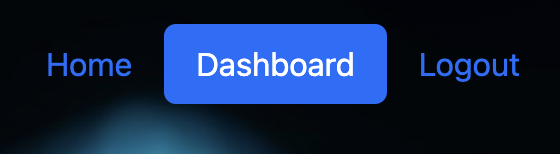

# Blog Site

## Description

This project produced a tech-blog that allows users to sign up, login and logout, make, edit or delete blogposts and leave comments on previously made posts!
The motivation behind this app was to produce a product would allow users to connect on various tech-related subjects. 
This project solves that by allowing users to communicate and collaborate.
By completing this project I was able to demonstrate ORM and MVC principals I learned in bootcamp coding class.

## Table of Contents

- [Installation](#Installation)
- [Useage](#Useage)
- [Credits](#Credits)
- [License](#License)
- [Questions](#Questions)

## Installation

Visit the deployed site on Heroku -

To see and edit this page locally,

Create a database in sequel using the "db" schema.

To seed the database with generic data run the following command:
"node seeds/seed.js"

Run the following commands in your integrated terminal.
"start": "node server.js",

## Useage

Upon visiting the site  you will be greeted with the hompage - a list of previously made blogposts and the option to login or sign up in the top right corner.

While in a logged out status, you can click on previous posts and be taken to the page to see the text of the post, author, created on and last updated info. 

Here you can also see comments left by other users.

If you want to join the conversation and leave a comment or start a new blogpost you will will need to either login or register - this can be done by clicking either option, whichever is applicable, at the top right corner of the screen.

After logging in or signing up, you will be taken to the dashboard page. From here you can make a new blogpost, see any previously made posts by you and the option to edit or delete them. 

Notice after logging in the nav bar has changed to reflect your available nav options

Deleting a post will remove the post and all related comments.

If you choose to edit the post, you will be taken to the following screen where you can edit your title or text.

Back on the home screen, while logged in, you can still see all posts on the site.

This time however, when you click on a post - you will now be presented with an option to leave a comment!

Please note - that logging out will be performed automatilly when idle for more than 5 minutes. However, you can logout manually at anytime by clicking the logout button in the top right cornet of the nav screen.

## Credits

Thank you to my bootcamp instructors, Roger and Sasha for the instruction that allowed me to build my app.

## License

MIT License

## Questions

https://github.com/coulterkyle

For questions regarding this app, contact me at:

e-mail: kcoulter2002@gmail.com